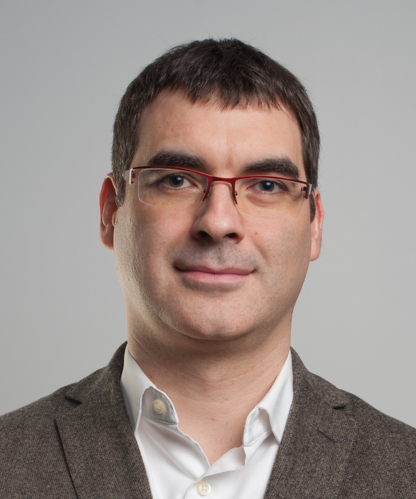

Over the years, progress on computer vision research has effectively benefitted medical domain, leading to development of several high impact image-guided interventions and therapies. While past couple of years have seen tremendous progress on 3D computer vision, especially in ADAS or driver-less navigation domains, the impact on medical domain has been limited. This workshop is to bring together the practitioners of 3D computer vision and medical domain and engage in a dialogue emphasizing the key recent advances and bridging the gap between 3d computer vision research and potential medical applications. 

The talks in the workshop cover following topics,
- **3D human body modeling and estimation**
Human body modeling (or patient modeling) is critical to several applications such as patient positioning for medical scanning, support for prosthetic design, computed assisted rehabilitation systems.
- **Non-rigid shape representation**
For human body, organs, vessels etc.; topics that emphasize the trade offs involved in volumetric or point-based representations
- **Endoscopic imaging and analysis for surgical guidance**
3D reconstruction using endoscopic imaging to provide guidance to surgical procedures
- **Scene representation and modeling for surgical and scanning workflow analysis** To localize the physicians and medical devices for workflow analysis during medical scanning as well as surgery and/or enable augmented reality applications
- **Scene reconstruction for navigation**
For navigation and path planning for devices

# Program
 
- **Date**: Sunday, June 16, 2019
- **Time**: 01:30p - 6:00p
- **Location**: Hyatt Beacon A

| Schedule        | Title         | Speaker       |
| --------------- | ------------- | ------------- |
| 1:30 PM  | Opening remarks  | [Yao-jen Chang](https://kevinyjchang.github.io/), [Vivek Singh](https://scholar.google.com/citations?user=E9-rksMAAAAJ&hl=en)|
| 1:35 PM  | Computer Vision for Monitoring Safety in the Operating Room  | [Nicolas Padoy](http://camma.u-strasbg.fr/npadoy) |
| 2:20 PM  | 3D Skeletal Tracking on Azure Kinect  | [Zicheng Liu](https://www.microsoft.com/en-us/research/people/zliu/) |
| 3:05 PM  | Coffee break | 
| 3:15 PM  | Ambient Intelligence in AI-Assisted Hospitals | [Serena Yeung](http://ai.stanford.edu/~syyeung/) |
| 4:00 PM  | Towards autonomous medical scanning | [Vivek Singh](https://scholar.google.com/citations?user=E9-rksMAAAAJ&hl=en), [Yao-jen Chang](https://kevinyjchang.github.io/) |
| 4:45 PM  | Towards the next generation of image guidance for endoscopic procedures | [Mathias Unberath](https://www.cs.jhu.edu/faculty/mathias-unberath/) |
| 5:30 PM  | Panel discussion |

# Invited Speakers
<figure>
    
    
    <figcaption>Nicolas Padoy University of Strasbourg </figcaption>
    
</figure>

# Organizers
- Vivek Singh, Siemens Healthineers
- Yao-jen Chang, Siemens Healthineers
- Ankur Kapoor, Siemens Healthineers
